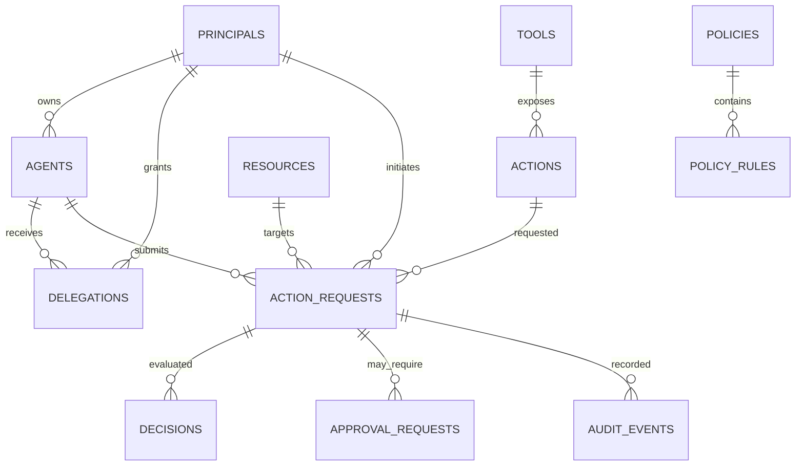

# AgentOS Domain Model

Phase 2 defines the smallest persistence model needed to evaluate an agent action later. The model keeps identity, delegated authority, policy authorization, risk, and the resulting decision separate.

## Relationship overview

An authenticated agent is an identity, not an authorization grant. A future decision pipeline must establish: the agent, the initiating principal, a valid delegation, the requested action/resource, applicable policy rules, contextual risk, and only then a decision.

## Entity definitions

### Agent

- **Purpose:** Stable identity for an autonomous software actor.
- **Required fields:** `id`, `name`, `owner_principal_id`, `purpose`, `version`, `status`, `risk_classification`, `created_at`, `updated_at`.
- **Optional fields:** `description`.
- **Identifier:** UUID `id`; display names are not identity.
- **Relationships:** Owned by one `Principal`; receives many `Delegation` records; submits many `ActionRequest` records.
- **Security significance:** Establishes who is acting, but does not itself grant permission.
- **Immutable fields:** `id`, `created_at`; ownership changes require an explicit lifecycle decision.
- **Mutable fields:** descriptive metadata, version, status, risk classification, timestamps.
- **Lifecycle/status:** `ACTIVE`, `SUSPENDED`, `RETIRED`.
- **Example:** `FinanceAgent`, version `1.0.0`, owned by principal `priyank`.

### AgentOwner / Principal

- **Purpose:** Authorization-domain representation of a human or organization responsible for an agent or granting authority.
- **Required fields:** `id`, `type`, `name`, `external_id`, `status`, `created_at`, `updated_at`.
- **Optional fields:** none in the MVP.
- **Identifier:** UUID `id`; `external_id` identifies the principal in a future identity provider.
- **Relationships:** Owns agents, issues delegations, initiates action requests, and may decide approvals.
- **Security significance:** Preserves the human or organizational identity behind delegated action. This is not authentication.
- **Immutable fields:** `id`, `type`, `external_id`, `created_at`.
- **Mutable fields:** name, status, updated timestamp.
- **Lifecycle/status:** `ACTIVE`, `SUSPENDED`, `RETIRED`.
- **Example:** type `HUMAN`, name `Priyank`, external ID `student-001`.

### Delegation

- **Purpose:** Explicit grant of authority from a principal to an agent.
- **Required fields:** `id`, `principal_id`, `agent_id`, `scope`, `status`, `issued_at`.
- **Optional fields:** `expires_at`, `metadata`.
- **Identifier:** UUID `id`.
- **Relationships:** References one granting `Principal` and one receiving `Agent`.
- **Security significance:** Answers what authority an agent received, from whom, and for how long. It is separate from policy authorization.
- **Immutable fields:** `id`, principal, agent, scope, issued time.
- **Mutable fields:** status, expiry, metadata.
- **Lifecycle/status:** `ACTIVE`, `REVOKED`, `EXPIRED`.
- **Example:** principal `Priyank` delegates scope `finance.transfer` to `FinanceAgent` until a stated expiry.

### Tool

- **Purpose:** A protected integration or capability grouping that exposes actions.
- **Required fields:** `id`, `name`, `description`, `status`.
- **Optional fields:** none in the MVP.
- **Identifier:** UUID `id`; name is unique.
- **Relationships:** Exposes many `Action` records.
- **Security significance:** Defines the capability boundary without implying that every action is allowed.
- **Immutable fields:** `id`.
- **Mutable fields:** name, description, status.
- **Lifecycle/status:** `ACTIVE`, `DISABLED`, `RETIRED`.
- **Example:** tool `Payments` exposes `bank_transfer` and `refund_payment`.

### Action

- **Purpose:** A specific operation available through a tool.
- **Required fields:** `id`, `tool_id`, `name`, `description`, `risk_level`, `status`.
- **Optional fields:** none in the MVP.
- **Identifier:** UUID `id`; action name is unique within its tool.
- **Relationships:** Belongs to one `Tool`; is referenced by many `ActionRequest` records.
- **Security significance:** Authorization is evaluated at action granularity; a tool being enabled does not authorize all of its actions.
- **Immutable fields:** `id`, `tool_id`, `name`.
- **Mutable fields:** description, risk level, status.
- **Lifecycle/status:** `ACTIVE`, `DISABLED`, `RETIRED`.
- **Example:** `bank_transfer`, risk `HIGH`, under `Payments`.

### Resource

- **Purpose:** Logical target of an action.
- **Required fields:** `id`, `resource_type`, `resource_key`, `sensitivity`, `status`.
- **Optional fields:** `owner_reference`.
- **Identifier:** UUID `id`; `(resource_type, resource_key)` is unique.
- **Relationships:** Target of many `ActionRequest` records.
- **Security significance:** Makes the protected object and its sensitivity explicit without storing business payloads.
- **Immutable fields:** `id`, `resource_type`, `resource_key`.
- **Mutable fields:** sensitivity, owner reference, status.
- **Lifecycle/status:** `ACTIVE`, `RESTRICTED`, `RETIRED`.
- **Example:** type `bank_account`, key `bank_account_001`, sensitivity `HIGH`.

### Policy

- **Purpose:** Versioned container for authorization rules.
- **Required fields:** `id`, `name`, `status`, `version`, `priority`, `created_at`, `updated_at`.
- **Optional fields:** `description`.
- **Identifier:** UUID `id`; `(name, version)` is unique.
- **Relationships:** Contains many `PolicyRule` records and is referenced by decisions.
- **Security significance:** Records which policy version was applicable; a later edit cannot silently rewrite a historical decision.
- **Immutable fields:** `id`, `version`, `created_at`.
- **Mutable fields:** description, status, priority, updated timestamp. Published rules should be treated as immutable by application policy.
- **Lifecycle/status:** `DRAFT`, `ACTIVE`, `RETIRED`.
- **Example:** `Finance transfer controls`, version `1`, priority `100`.

### PolicyRule

- **Purpose:** Deterministic, data-driven authorization rule within a policy.
- **Required fields:** `id`, `policy_id`, `effect`, `action`, `resource_type`, `priority`.
- **Optional fields:** `conditions` JSONB.
- **Identifier:** UUID `id`.
- **Relationships:** Belongs to one `Policy`; matches action names and resource types.
- **Security significance:** Stores policy intent only. Phase 2 does not evaluate it, and client code cannot manufacture a decision.
- **Immutable fields:** `id`, `policy_id`.
- **Mutable fields:** effect, match fields, conditions, priority while policy is draft.
- **Lifecycle/status:** Follows its policy; no independent status in the MVP.
- **Example:** `ALLOW` `bank_transfer` on `bank_account` where `amount <= 5000`.

### ActionRequest

- **Purpose:** Immutable-in-meaning record of an agent's requested operation before authorization.
- **Required fields:** `id`, `agent_id`, `principal_id`, `action_id`, `resource_id`, `parameters`, `requested_at`, `status`, `idempotency_key`.
- **Optional fields:** none in the MVP.
- **Identifier:** UUID `id`; `idempotency_key` is unique.
- **Relationships:** References the acting agent, initiating principal, requested action, and target resource; has decisions, approval requests, and audit events.
- **Security significance:** Preserves the original request independently from the eventual decision. Request data is not authorization.
- **Immutable fields:** identity references, action/resource references, parameters, request time, idempotency key.
- **Mutable fields:** processing status only.
- **Lifecycle/status:** `RECEIVED`, `EVALUATED`, `APPROVAL_PENDING`, `COMPLETED`, `REJECTED`.
- **Example:** `FinanceAgent` requests `bank_transfer` against `bank_account_001` with amount `18000`.

### Decision

- **Purpose:** Immutable result of a future policy/risk evaluation.
- **Required fields:** `id`, `action_request_id`, `decision`, `reason`, `decided_at`.
- **Optional fields:** `policy_id`, `policy_version`, `risk_score`.
- **Identifier:** UUID `id`.
- **Relationships:** References one `ActionRequest` and optionally the policy snapshot that was used.
- **Security significance:** Separates authorization output from input and preserves explainability and traceability.
- **Immutable fields:** all fields after creation.
- **Mutable fields:** none; correction means a new decision or explicit event, never an update.
- **Lifecycle/status:** `ALLOW`, `BLOCK`, `REQUIRE_APPROVAL` as the decision value.
- **Example:** `REQUIRE_APPROVAL`, reason `amount exceeds autonomous limit`, risk score `87`.

### ApprovalRequest

- **Purpose:** Future human review record for a request that cannot proceed autonomously.
- **Required fields:** `id`, `action_request_id`, `requested_by`, `status`, `reason`.
- **Optional fields:** `decided_by`, `decided_at`, `expires_at`.
- **Identifier:** UUID `id`.
- **Relationships:** Belongs to one action request and references principals for requester/reviewer roles.
- **Security significance:** Makes human escalation explicit and records the reviewer separately from the acting agent.
- **Immutable fields:** `id`, action request, requester, reason.
- **Mutable fields:** status and decision metadata until resolved.
- **Lifecycle/status:** `PENDING`, `APPROVED`, `REJECTED`, `EXPIRED`.
- **Example:** principal `Priyank` requests a one-time exception review for an `$18,000` transfer.

### AuditEvent

- **Purpose:** Append-oriented record of security-relevant lifecycle events.
- **Required fields:** `id`, `event_type`, `actor_type`, `actor_id`, `event_data`, `created_at`.
- **Optional fields:** `agent_id`, `action_request_id`, `decision_id`.
- **Identifier:** UUID `id`.
- **Relationships:** May link an event to an agent, request, and decision.
- **Security significance:** Provides evidence without mutating the request or decision that occurred.
- **Immutable fields:** all fields after creation.
- **Mutable fields:** none. Corrections are compensating events.
- **Lifecycle/status:** append-only; no status.
- **Example:** `DECISION_RECORDED`, actor `SYSTEM`, linked to request and decision IDs.
