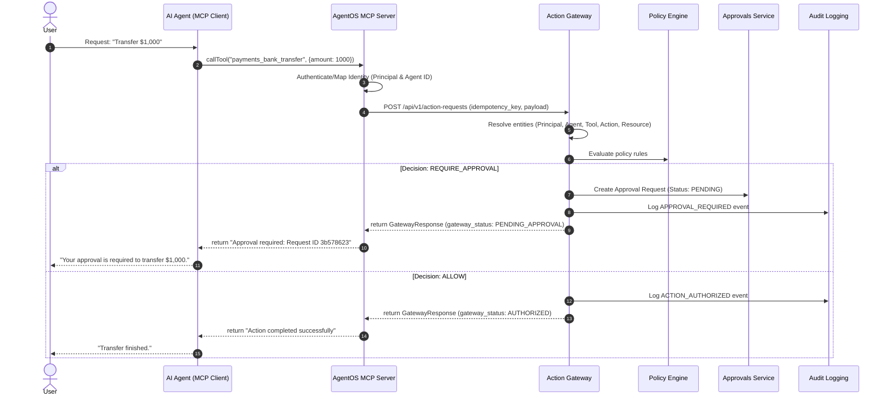

<!-- STATUS: STALE / HISTORICAL. This document predates the verified Chunks 1-3 state and may contradict current runtime behavior (e.g., sandbox execution, FinancialExecution ledger, tenant model, REST/MCP auth). Canonical sources: AGENTOS_OPERATING_PROMPT.md and AGENTOS_STATE.md. Do not use as source of truth. -->
# AgentOS MCP Server Architecture

This document defines the implementation design for an **AgentOS MCP Server** sitting above the existing AgentOS control plane and runtime gateway.

---

## 1. System Overview

The Model Context Protocol (MCP) layer is designed as a stateless wrapper over the AgentOS **Action Gateway**. 
By design, the LLM and the MCP client are completely untrusted. The MCP server acts as a translator that maps natural language capabilities to formal, evaluated gateway requests.



---

## 2. Architectural Design Details

### A. Identity Propagation (Session Context)
The MCP client must propagate the active identity of both the **Principal** (the human user orchestrating the agent) and the **Agent** (the specific AI running the execution).
*   **Propagation Protocol**: Context is passed using connection-level initialization parameters (in `initialize` request) or session-level HTTP/SSE headers:
    - `X-AgentOS-Principal-ID`: Maps to `Principal.id`
    - `X-AgentOS-Agent-ID`: Maps to `Agent.id`
*   **Verification**: The MCP server extracts these headers on every tool execution call and passes them directly to the `GatewayRequestCreate` payload. The Action Gateway will resolve and validate them against the database. If a mismatch exists, the gateway rejects the request.

### B. Tool Discovery & Dynamic Naming
MCP tools are derived dynamically from the `Tool` and `Action` registries stored in the database.
*   **Tool Discovery Strategy**: When the MCP client calls `listTools`, the MCP server queries `GET /api/v1/tools` and fetches all corresponding actions.
*   **Naming Convention**: To ensure LLM-friendliness and consistency, tools are formatted as:
    ```
    {tool_name_lowercase}_{action_name_lowercase}
    ```
    *Example*: Tool `Payments` + Action `bank_transfer` becomes MCP tool `payments_bank_transfer`.

### C. Request Mapping Lifecycle
When the MCP client calls `callTool(name, arguments)`:
1.  **Extract Arguments**: Extract parameters directly.
2.  **Generate Idempotency Key**: Generate a unique, deterministic idempotency key using the hash of the payload plus the request context to prevent duplicate submissions.
3.  **Submit to Gateway**: Call `POST /api/v1/action-requests` with:
    ```json
    {
      "principal_id": "X-AgentOS-Principal-ID",
      "agent_id": "X-AgentOS-Agent-ID",
      "action_id": "resolved_action_id",
      "resource_id": "resolved_resource_id",
      "parameters": "arguments",
      "idempotency_key": "deterministic_key"
    }
    ```

### D. Parameter Validation
*   **Type Constraints**: Parameter types are validated by the MCP server using Pydantic schemas mapped from `Action.parameters` schemas before sending requests to the Action Gateway.
*   **Gateway Safeguard**: The Action Gateway performs a second strict schema validation step upon payload ingestion.

### E. Policy, Risk, and Approval Boundaries
*   **Policy Evaluation Boundary**: The MCP server has *no direct database access* and *no policy code logic*. It delegates policy evaluation entirely to the REST API's Policy Engine via the Action Gateway.
*   **Risk Engine Boundary**: The Risk Engine is triggered internally by the Action Gateway.
*   **Approval Handling**: If a tool call returns `PENDING_APPROVAL`, the MCP server blocks execution and returns an informative string to the AI Agent detailing the `action_request_id` and indicating that user intervention is required.

### F. Result/Error & Audit Event Mapping
*   **Error Propagation**: Standard HTTP error codes (e.g. `400 Bad Request`, `422 Unprocessable Entity`, `409 Conflict`) are translated by the MCP server to standard JSON-RPC error codes (e.g. `InvalidParams`, `InternalError`) and returned cleanly to the client.
*   **Audit Logging**: The MCP server does not write audit logs. It relies entirely on the Action Gateway to write `ACTION_REQUEST_RECEIVED`, `POLICY_EVALUATED`, `RISK_EVALUATED`, `APPROVAL_REQUESTED`, and `ACTION_AUTHORIZED`/`ACTION_BLOCKED` events.
