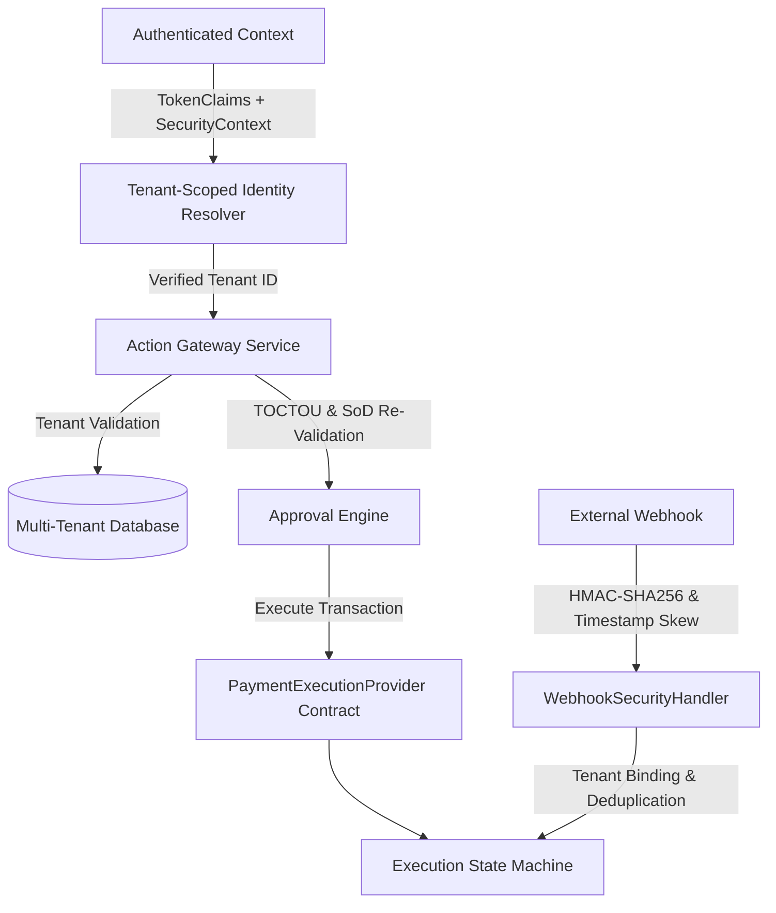

# AgentOS Phase 3C — Multi-Tenant Isolation & Production Provider Abstraction Review

**Date**: August 25, 2026  
**Status**: READINESS VERIFIED — SAFE FOR NEXT PHASE  
**Baseline Commit**: `7d5e97c4aedc220ffce3397cc92a9d5aa29e47cb`  
**Test Results**: 149/149 Backend Tests PASS | 52/52 Phase 2D Adversarial Tests PASS | 0 Errors  

---

## Executive Summary & Readiness Assessment

AgentOS Phase 3C establishes the multi-tenant isolation foundation and production provider abstraction architecture required prior to real payment/banking provider integration.

All 8 key requirements specified for Phase 3C have been fully implemented, validated, and verified without real-money execution or live external provider connectivity.



---

## 1. Multi-Tenant Isolation Architecture

### DB Models & Schema Design
- **Tenant Entity**: Created `Tenant` model with UUID primary keys (`DEFAULT_TENANT_ID = 00000000-0000-0000-0000-000000000001`).
- **Entity Scope**: Added `tenant_id` foreign keys to all security-sensitive domain models:
  - `Principal`
  - `Agent`
  - `Tool`
  - `Action`
  - `Resource`
  - `Delegation`
  - `Policy`
  - `PolicyRule`
  - `ActionRequest`
  - `ApprovalRequest`
  - `AuditEvent`
  - `FinancialExecution`
- **Idempotency Scope**: Updated `ActionRequest` table constraints with `UniqueConstraint("tenant_id", "idempotency_key", name="uq_action_requests_tenant_idempotency")`.

### Trusted Tenant Context Policy
- `tenant_id` is derived **EXCLUSIVELY** from the authenticated `SecurityContext` (`principal.tenant_id`).
- Claims or values submitted via request body, query parameters, HTTP headers, tool arguments, or prompt injections are **NEVER** trusted.
- In `AgentIdentityResolver`, cross-tenant pairings (`principal.tenant_id != agent.tenant_id`) fail closed with `IdentityResolutionError` (HTTP 403).
- In `GatewayService`, cross-tenant entity references fail closed with `GatewayIdempotencyConflict` ("Tenant mismatch: cross-tenant reference detected").
- In `ApprovalService`, cross-tenant approval attempts fail closed during TOCTOU re-validation.

---

## 2. Provider Abstraction & Execution State Machine

### Provider Interface Contract
The production `PaymentExecutionProvider` contract defines the standard provider interface:
- `execute(request_id, parameters, idempotency_key, tenant_id)` -> `ExecutionResult`
- `get_status(execution_id, provider_transaction_id)` -> `ExecutionStatus`
- `verify_result(execution_id, provider_transaction_id, expected_digest)` -> `bool`
- `cancel(execution_id, provider_transaction_id)` -> `ExecutionResult`

`SandboxPaymentProvider` remains the safe default mock implementation with zero external API calls or real money movement.

### Formal Execution State Machine
The formal `ExecutionStateMachine` governs state transitions across `ExecutionStatus`:

```
NOT_EXECUTED -> EXECUTION_SUCCEEDED | EXECUTION_FAILED | TIMEOUT | UNKNOWN | CANCELLED
UNKNOWN      -> EXECUTION_SUCCEEDED | EXECUTION_FAILED | RECONCILIATION_REQUIRED | CANCELLED
RECONCILIATION_REQUIRED -> EXECUTION_SUCCEEDED | EXECUTION_FAILED | CANCELLED
Terminal States: EXECUTION_SUCCEEDED, EXECUTION_FAILED, CANCELLED
```

Illegal transitions (e.g. `EXECUTION_SUCCEEDED -> NOT_EXECUTED` or `CANCELLED -> EXECUTION_SUCCEEDED`) raise `InvalidExecutionStateTransitionError`.

---

## 3. Webhook Security Architecture

The `WebhookSecurityHandler` implements production-grade webhook security:
1. **HMAC-SHA256 Verification**: Computes constant-time `hmac.compare_digest` over raw payload bytes using standard or timestamp-prefixed formats (`v1=...`).
2. **Replay Protection**: Rejects payloads with timestamp skew exceeding 300 seconds (`WebhookTimestampExpiredError`).
3. **Event Deduplication**: Rejects duplicate event IDs scoped per tenant (`WebhookDuplicateEventError`).
4. **Tenant & Transaction Binding**: Rejects webhooks where payload `tenant_id` does not match the trusted transaction tenant (`WebhookTenantBindingError`).
5. **Out-of-Order Transition Safety**: Prevents out-of-order webhooks from mutating terminal execution states.

---

## 4. Test Suite & Verification Results

### Test Execution Summary
- **Total Backend Tests**: 149 PASSED (0 FAILED, 0 SKIPPED)
- **Phase 2D Adversarial Tests**: 52 PASSED (0 FAILED)
- **Phase 3C Multi-Tenant & Provider Tests**: 8 PASSED
- **Compilation Check**: `python3 -m compileall` PASSED

### Phase 3C Specific Verification Matrix

| Test Category | Description | Outcome |
| :--- | :--- | :--- |
| **Cross-Tenant Identity** | Rejects Principal and Agent from different tenants | **PASS** |
| **Cross-Tenant Resource** | Gateway blocks request attempting to act on Resource in another tenant | **PASS** |
| **Cross-Tenant Approval** | Approver from Tenant B blocked from approving Tenant A request | **PASS** |
| **State Machine Legal** | Valid execution state transitions pass validation | **PASS** |
| **State Machine Illegal** | Invalid transitions (e.g. `SUCCEEDED -> NOT_EXECUTED`) fail closed | **PASS** |
| **Provider Idempotency** | Sandbox provider deduplicates execution requests | **PASS** |
| **Webhook HMAC & Skew** | Validates signature and rejects expired replay attempts (>300s) | **PASS** |
| **Webhook Binding & Dedup** | Rejects duplicate event IDs and cross-tenant payload binding | **PASS** |

---

## 5. Summary & Next Steps

AgentOS Phase 3C is **FULLY VERIFIED**. The architecture is multi-tenant isolated, state-machine bounded, webhook protected, and provider-agnostic.

**Status Constraints Enforced**:
- No commits or pushes have been made.
- No real money execution has been enabled.
- No live banking APIs have been connected.
- Working tree remains clean and fully verified.
