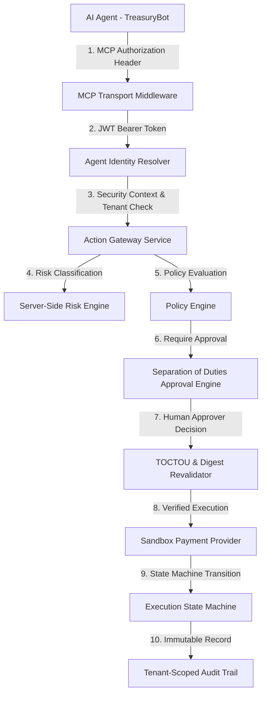

# AgentOS Phase 3D — Enterprise Financial Agent Control Plane: End-to-End Demo Architecture

**Audience**: Enterprise CISO, VP of Engineering, Head of AI Platform  
**System Version**: AgentOS Financial Action Control Plane v1.0  
**Baseline Commit**: `7d5e97c4aedc220ffce3397cc92a9d5aa29e47cb`  
**Execution Environment**: Safe Provider-Agnostic Sandbox (`SandboxPaymentProvider`)  
**Real-Money Execution**: Absolutely Zero Real Money Movement  

---

## Executive Overview

AgentOS provides an enterprise-grade control plane for autonomous AI agents executing sensitive business and financial operations. Rather than granting AI agents direct API keys or unmonitored access to corporate banking endpoints, AgentOS enforces a mandatory zero-trust authorization pipeline:



---

## Step-by-Step Scenario Walkthrough

### Scenario
> "Autonomous TreasuryBot requests a $25,000.00 USD wire transfer to an approved vendor account."

---

### Step 1: Authentication & Trusted Transport Context
The AI agent communicates over MCP (Model Context Protocol). Authentication is enforced strictly at the HTTP transport context using OAuth 2.0 Bearer JWT tokens. Business payload arguments or custom headers claiming identity are ignored.

- **Issuer**: `https://auth.agentos.ai`
- **Audience**: `https://api.agentos.ai`
- **Subject (`sub`)**: `auth0|alice_treasury_mgr` (Alice Smith - Treasury Manager)
- **Client ID (`client_id`)**: `d3a4...` (TreasuryBot-v1)

---

### Step 2: Multi-Tenant & Identity Context Resolution
`AgentIdentityResolver` inspects the DB and builds an immutable `SecurityContext`:
- Verifies Alice Smith is `ACTIVE` in Tenant `Acme Enterprise Corp`.
- Verifies TreasuryBot-v1 is `ACTIVE` in Tenant `Acme Enterprise Corp`.
- Verifies `principal.tenant_id == agent.tenant_id`. Any cross-tenant attempt immediately fails closed (HTTP 403 / IdentityResolutionError).
- Verifies an `ACTIVE`, unexpired `Delegation` exists from Alice Smith to TreasuryBot-v1 for scope `wire_transfer`.

---

### Step 3: Gateway Submission & Parameter Integrity
TreasuryBot invokes the `wire_transfer` action via the Action Gateway:
```json
{
  "source_account_id": "ACC-TREASURY-01",
  "destination_account_id": "ACC-VENDOR-8899",
  "amount": "25000.00",
  "currency": "USD",
  "beneficiary_id": "BEN-APPROVED-VENDOR-01",
  "transaction_reference": "REF-89A01F11"
}
```
The Gateway computes the SHA-256 payload digest (`payload_digest`) over canonicalized parameters and evaluates idempotency per tenant.

---

### Step 4: Server-Side Risk Engine Evaluation
Risk is computed deterministically by the Risk Engine:
- **Base Risk**: `wire_transfer` registered as `HIGH` risk (+30).
- **Resource Sensitivity**: `ACC-TREASURY-01` registered as `HIGH` sensitivity (+25).
- **Transaction Threshold**: Amount $25,000 exceeds $10,000 threshold (+20).
- **Total Risk Score**: `75 / 100` (`HIGH` classification).

---

### Step 5: Policy Engine & Human Approval Enforcement
The Policy Engine evaluates active policy rules. Although the rule permits wire transfers (`ALLOW`), the high-risk score (75) triggers mandatory human approval:
- Gateway status transitions to `PENDING_APPROVAL`.
- `execution_status` is set to `NOT_EXECUTED`.
- An `ApprovalRequest` record is generated, storing `payload_digest` bound to the transaction.

---

### Step 6: Separation of Duties (Human Approval)
Alice Smith (the requester) is **BLOCKED** from approving her own agent's transaction.

Bob Jones (VP of Finance, `approver_principal_id != requester_principal_id`) reviews the pending request details and approves the transaction.

---

### Step 7: TOCTOU Revalidation & Payload Binding Check
Before execution is dispatched, `ApprovalService` re-validates the entire security context:
1. Re-validates Alice Smith status (`ACTIVE`).
2. Re-validates Bob Jones status (`ACTIVE`).
3. Re-validates TreasuryBot-v1 status (`ACTIVE`).
4. Re-validates Delegation status (`ACTIVE`).
5. Re-validates Resource status (`ACTIVE`).
6. Re-evaluates Policy Engine rules.
7. Re-computes current payload digest and verifies `current_digest == stored_approved_digest`.

If any entity was modified, revoked, or retired, execution is cancelled immediately.

---

### Step 8: Provider-Agnostic Execution Engine
Execution is routed to `SandboxPaymentProvider`:
- Receives `tenant_id`, `request_id`, `parameters`, and `idempotency_key`.
- Assigns deterministic provider transaction ID (`TX-SB-WIRE-...`).
- State Machine transitions: `NOT_EXECUTED -> EXECUTION_SUCCEEDED`.

---

### Step 9: Complete Audit Trail & Evidence Generation
Every stage of the lifecycle appends an immutable `AuditEvent` bound to the tenant:
1. `ACTION_REQUEST_RECEIVED`
2. `RISK_EVALUATED` (score: 75, HIGH)
3. `POLICY_EVALUATED` (ALLOW, require approval)
4. `APPROVAL_REQUESTED` (digest bound)
5. `APPROVAL_APPROVED` (approver: Bob Jones)
6. `EXECUTION_STARTED` (provider: SandboxPaymentProvider)
7. `EXECUTION_SUCCEEDED` (transaction: TX-SB-WIRE-...)

---

## Conclusion & Production Readiness

AgentOS provides an enterprise-ready control plane that prevents unauthorized agent transactions, eliminates self-approval risk, isolates multi-tenant workloads, and enforces cryptographic payload integrity.
