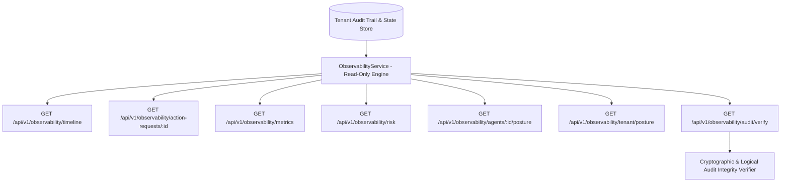

# AgentOS Phase 3E — Enterprise Security Observability & Control Plane

**System Version**: AgentOS Observability & Control Plane v1.0  
**Baseline Commit**: `7d5e97c4aedc220ffce3397cc92a9d5aa29e47cb`  
**Security Boundary**: 100% Read-Only APIs — Zero Mutation Capability  
**Tenant Isolation**: Strict Tenant Context Scoping (`SecurityContext.tenant_id`)  

---

## Executive Architecture

AgentOS Phase 3E introduces the Enterprise Security Observability and Control Plane layer. This layer transforms distributed agent interactions, MCP requests, identity resolutions, risk calculations, policy decisions, human approvals, execution transitions, and audit events into unified, enterprise-readable security telemetry.

---

## Key Observability Components

### 1. Security Event Timeline (`GET /api/v1/observability/timeline`)
Provides a chronologically ordered, tenant-isolated security event stream with event type filtering and pagination. Event categories tracked:
- Authentication & Identity Resolution
- Delegation & Scope Verification
- Action Request Receipt
- Server-Side Risk Score Evaluation
- Policy Engine Evaluations (ALLOW / DENY / REQUIRE_APPROVAL)
- Human Approval Requests & Decisions (Approved / Rejected)
- TOCTOU Revalidation Rejections
- Cryptographic Payload Tamper Detections
- Sandbox Provider Execution State Transitions
- Webhook Ingestion Events (Accepted / Signature Rejected / Duplicate)
- Idempotency Conflict Alerts

---

### 2. Action Request Detail (`GET /api/v1/observability/action-requests/{request_id}`)
Provides full end-to-end trace for a specific action request:
- **Tenant Scope**: Tenant UUID and slug
- **Identity Triad**: Principal, Agent, and active Delegation
- **Target Capability**: Tool, Action, and Resource
- **Payload & Digest**: Canonical JSON parameters and SHA-256 payload digest
- **Risk Evaluation**: Score (0-100), classification, and individual risk factors
- **Policy Decision**: Rule ID, priority, effect, and decision reason code
- **Approval Breakdown**: Status, requester ID, approver ID, and decision timestamp
- **Execution Telemetry**: State machine status, provider name, and transaction reference

---

### 3. Security Dashboard Metrics (`GET /api/v1/observability/metrics`)
Exposes real-time aggregated security counters:
- `total_action_requests`
- `pending_approvals`
- `approved_executions`
- `rejected_actions`
- `toctou_violations`
- `payload_tampering_attempts`
- `authentication_failures`
- `cross_tenant_attempts`
- `webhook_failures`
- `idempotency_conflicts`
- `execution_failures_timeouts`

---

### 4. Risk Dashboard (`GET /api/v1/observability/risk`)
Categorizes agent action requests across risk tiers (`LOW`, `MEDIUM`, `HIGH`, `CRITICAL`), exposing highest-risk action telemetry, approval-required requests, and blocked high-risk attempts.

---

### 5. Identity Posture Telemetry (`GET /api/v1/observability/agents/{agent_id}/posture` & `GET /api/v1/observability/tenant/posture`)
- **Agent Security Posture**: Associated owner principals, active delegations, total action volume, rejected attempt count, security violation count, and last activity timestamp.
- **Tenant Security Posture**: Active principal count, active agent count, active delegation count, total action volume, approval volume, execution volume, security violations, and high-risk activity count.

---

### 6. Automated Audit Integrity Verification (`GET /api/v1/observability/audit/verify`)
Automated integrity analysis engine scanning audit logs for 7 critical security anomalies:
1. `MISSING_AUDIT_EVENT`: Requests lacking audit event records.
2. `IMPOSSIBLE_EVENT_ORDERING`: Out-of-order execution states.
3. `CROSS_TENANT_CONTAMINATION`: Cross-tenant event leakage.
4. `EXECUTION_WITHOUT_APPROVAL`: High-risk execution without approved state.
5. `APPROVAL_WITHOUT_VALID_REQUESTER`: Separation of Duties violation (self-approval).
6. `EXECUTION_AFTER_REVOKED_DELEGATION`: Execution under revoked delegation.
7. `PAYLOAD_DIGEST_MISMATCH`: Mismatched payload SHA-256 hash digests.

---

## Security Guarantees & Constraints

- **Strict Read-Only Design**: All observability endpoints respond exclusively to HTTP `GET`. Any `POST`, `PUT`, `PATCH`, or `DELETE` attempt returns HTTP 405 Method Not Allowed. The control plane cannot be abused to mutate state or bypass authorization controls.
- **Zero Cross-Tenant Data Leakage**: Tenant scope is enforced strictly from the trusted context (`SecurityContext.tenant_id`). Tenant spoofing attempts via headers or query params fail closed (HTTP 403).
