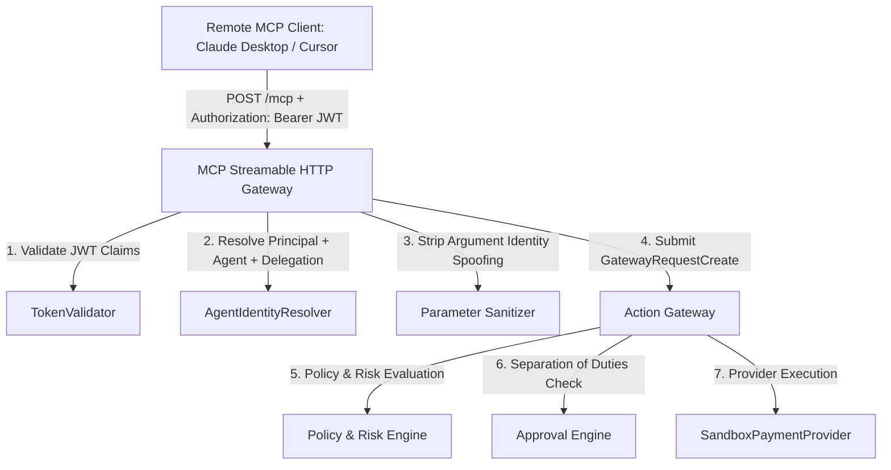

# AgentOS Phase 4A — MCP Streamable HTTP Architecture Specification

**System Version**: AgentOS MCP Gateway v1.0 (Streamable HTTP Edition)  
**Baseline Commit**: `7d5e97c4aedc220ffce3397cc92a9d5aa29e47cb`  
**Protocol Version**: `2024-11-05` / `2024-11-25`  
**Transport Protocol**: Streamable HTTP (`POST /mcp`, `POST /mcp/v1/messages`, `GET /.well-known/mcp`)  

---

## Executive Overview

AgentOS Phase 4A transitions the Model Context Protocol (MCP) transport from server-sent events (SSE) to **MCP Streamable HTTP**. This architecture allows state-less, scalable HTTP POST JSON-RPC messaging while preserving 100% of AgentOS's zero-trust security invariants.



---

## 1. Transport Endpoints

| Endpoint Path | HTTP Method | Description | Security Controls |
| :--- | :-: | :--- | :--- |
| **`/mcp`** | `POST` | Primary MCP Streamable HTTP JSON-RPC endpoint | `Authorization: Bearer <token>` required. Content-Type `application/json`. |
| **`/mcp/v1/messages`** | `POST` | Versioned Streamable HTTP JSON-RPC endpoint | Identical authorization and validation as `/mcp`. |
| **`/.well-known/mcp`** | `GET` | Protected Resource Discovery Metadata | Public discovery document detailing scopes and authorization type (`Bearer`). |
| **`/mcp/metadata`** | `GET` | MCP Server Metadata Endpoint | Identical metadata payload for clients querying `/mcp/metadata`. |
| **`/mcp/sse`** | `GET`/`POST` | Legacy SSE Compatibility Endpoint (**Deprecated**) | Emits HTTP headers `Deprecation: @1735689600` and `Sunset: 2026-12-31`. |

---

## 2. MCP JSON-RPC Method Handling

The Streamable HTTP Gateway processes standard MCP JSON-RPC 2.0 requests:

1. **`initialize`**: Responds with server capabilities and protocol version `2024-11-05`.
2. **`notifications/initialized`**: Returns HTTP `202 Accepted`.
3. **`ping`**: Returns HTTP `200 OK` JSON-RPC result.
4. **`tools/list`**: Returns registered tools (`execute_action`).
5. **`tools/call`**: Invokes `execute_action(action_id, resource_id, parameters, idempotency_key)` using trusted JWT context.

---

## 3. Protected Resource Metadata Specification

Remote clients can discover authorization requirements by sending `GET /.well-known/mcp`:

```json
{
  "name": "AgentOS MCP Server",
  "version": "0.1.0",
  "protocol_version": "2024-11-05",
  "transport": "Streamable-HTTP",
  "capabilities": {
    "tools": {"listChanged": false},
    "resources": {"subscribe": false, "listChanged": false}
  },
  "protected_resource": {
    "resource_id": "urn:agentos:mcp:action-gateway",
    "authorization_type": "Bearer",
    "scopes": ["mcp:execute_action"]
  }
}
```

If an unauthenticated request is sent to `POST /mcp`, AgentOS responds with HTTP 401 Unauthorized and standard challenge headers:

```http
HTTP/1.1 401 Unauthorized
WWW-Authenticate: Bearer realm="AgentOS", error="invalid_token", scope="mcp:execute_action"
Content-Type: application/json

{
  "jsonrpc": "2.0",
  "id": null,
  "error": {
    "code": -32000,
    "message": "Authentication failed: Missing Authorization header in request context"
  }
}
```
