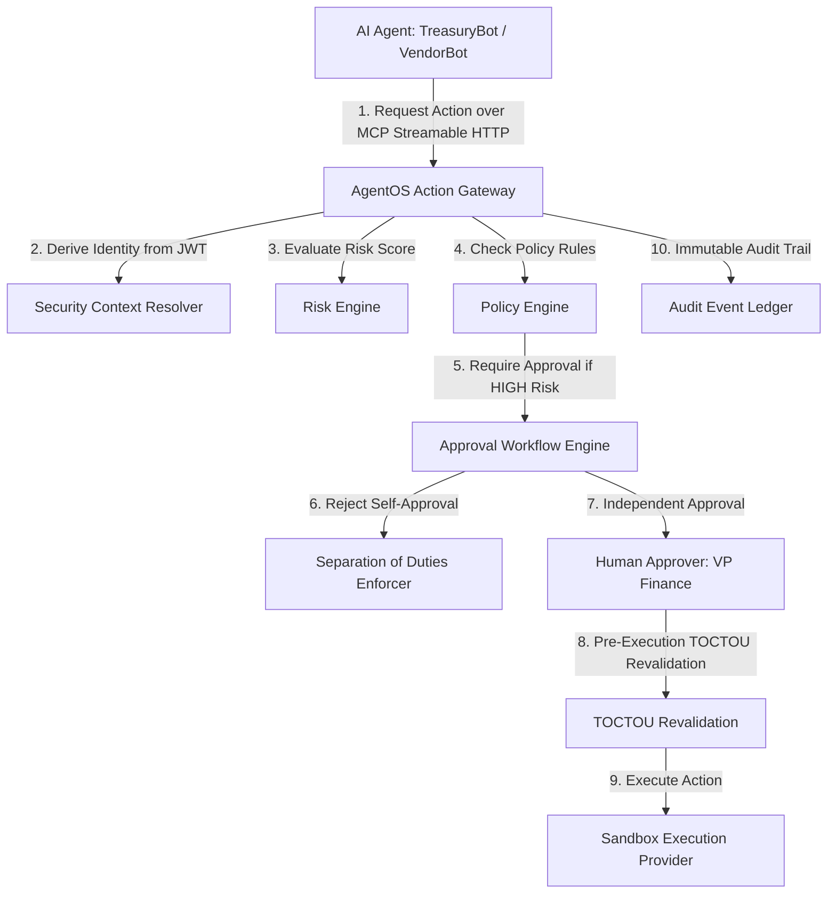

# AgentOS Phase 4B — Enterprise Security Control Plane Customer Demonstration Guide

**Core Value Proposition**: *"Your AI agents can act. AgentOS decides whether those actions are allowed."*  
**Audience**: CISO, CTO, Head of AI Engineering, CFO / Treasury, VP Security Engineering  
**System Version**: AgentOS Control Plane v1.0 (Phase 4B Sandbox Edition)  

---

## 1. Executive Summary & Persona Narrative

As enterprise organizations deploy autonomous AI agents (Claude, Cursor, LangChain, AutoGen, CrewAI), traditional API gateways fail to protect high-risk financial and operational actions. AI agents operate with dynamic prompts, fuzzy logic, and potential prompt injection vulnerabilities.

**AgentOS** sits between AI agents and enterprise backends/financial rails, functioning as an unbypassable, zero-trust Financial Action Control Plane.

---

## 2. 5-Minute CISO Demonstration Script

### Act 1: The AI Agent Requests a $25,000 Wire Transfer
1. **Agent Authentication**: TreasuryBot authenticates via OAuth Bearer JWT. Identity is resolved strictly to `Principal: Alice Smith`, `Agent: TreasuryBot-v1`, `Tenant: Global Treasury Corp`.
2. **Tool Discovery**: TreasuryBot calls `tools/list` over MCP Streamable HTTP (`POST /mcp`) and discovers the `execute_action` tool.
3. **Action Submission**: TreasuryBot invokes `execute_action` to send a $25,000 USD wire transfer to an approved vendor.

### Act 2: Server-Side Risk & Policy Evaluation
4. **Risk Scoring**: Server-side Risk Engine evaluates transaction parameters. High value ($25,000 > $10,000 threshold) scores **HIGH Risk (75/100)**.
5. **Policy Gate**: Policy Engine requires human approval for any high-risk financial transfer. Status transitions to `PENDING_APPROVAL`.

### Act 3: Separation of Duties (SoD) Rejection
6. **Self-Approval Attack**: Alice Smith (the requesting principal) attempts to approve the transaction herself via the API/Dashboard.
7. **AgentOS Defense**: AgentOS detects `requester_principal == approver_principal`, rejects the approval attempt with a `SECURITY_SEPARATION_OF_DUTIES_VIOLATION` error, and transitions the request to `REJECTED`.

### Act 4: Independent Approval & Sandbox Settlement
8. **Independent Approver**: Bob Jones (VP Finance) reviews the request on the AgentOS Control Plane Dashboard and grants approval.
9. **Pre-Execution TOCTOU Revalidation**: AgentOS re-checks principal status, agent status, delegation validity, policy rules, and SHA-256 payload digest. All remain valid.
10. **Sandbox Settlement**: SandboxPaymentProvider settles the wire transfer, returning provider transaction reference `exec-sb-45929b39cdf38052`.

### Act 5: Immutable Telemetry & Audit Integrity
11. **12-Stage Audit Trail**: AgentOS records 12 immutable audit events from request receipt to final settlement.

---

## 3. Live Attack Simulation Suite (10 Standard Attacks)

All 10 attack vectors fail closed:

1. **Tenant Spoofing**: Foreign `X-Tenant-ID` header rejected (HTTP 403).
2. **Agent Identity Spoofing**: Injected `agent_id` in arguments stripped & ignored.
3. **Principal Identity Spoofing**: Injected `principal_id` in parameters stripped & ignored.
4. **Post-Approval Payload Tampering**: Digest mismatch blocks execution (HTTP 409).
5. **Self-Approval Violation**: Requester approval rejected (HTTP 409).
6. **Revoked Delegation Execution**: TOCTOU revalidation blocks execution (HTTP 409).
7. **Cross-Tenant Resource Access**: Cross-tenant reference blocked (HTTP 409).
8. **Duplicate Submission**: Idempotency conflict detected (HTTP 409).
9. **Webhook Forgery**: Invalid HMAC signature rejected (HTTP 401).
10. **Webhook Replay**: Stale timestamp rejected (HTTP 400).
