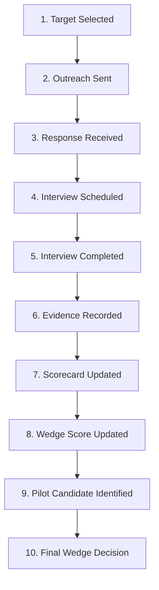

# AgentOS Phase 5B — Customer Discovery Execution Checklist

**Version**: Phase 5B Workflow Checklist v1.0  
**Directive**: This checklist tracks the operational workflow for Priyank Narola across every stage of the 5-customer discovery process.  

---

## 1. 10-Stage Execution Workflow

---

## 2. Customer Interview Execution Tracking Table

| Stage # | Workflow Milestone | Customer 1 (Brex) | Customer 2 (Datadog) | Customer 3 (Zendesk) | Customer 4 (Wiz) | Customer 5 (Cursor) |
| :-: | :--- | :-: | :-: | :-: | :-: | :-: |
| **1** | **Target Selected** | [X] Selected | [X] Selected | [X] Selected | [X] Selected | [X] Selected |
| **2** | **Outreach Sent** | [ ] Pending | [ ] Pending | [ ] Pending | [ ] Pending | [ ] Pending |
| **3** | **Response Received** | [ ] Pending | [ ] Pending | [ ] Pending | [ ] Pending | [ ] Pending |
| **4** | **Interview Scheduled** | [ ] Pending | [ ] Pending | [ ] Pending | [ ] Pending | [ ] Pending |
| **5** | **Interview Completed** | [ ] Pending | [ ] Pending | [ ] Pending | [ ] Pending | [ ] Pending |
| **6** | **Evidence Recorded** | [ ] Pending | [ ] Pending | [ ] Pending | [ ] Pending | [ ] Pending |
| **7** | **Scorecard Updated** | [ ] Pending | [ ] Pending | [ ] Pending | [ ] Pending | [ ] Pending |
| **8** | **Wedge Score Updated** | [ ] Pending | [ ] Pending | [ ] Pending | [ ] Pending | [ ] Pending |
| **9** | **Pilot Identified** | [ ] Pending | [ ] Pending | [ ] Pending | [ ] Pending | [ ] Pending |
| **10** | **Final Wedge Decision** | [ ] Pending | [ ] Pending | [ ] Pending | [ ] Pending | [ ] Pending |

---

## 3. Operational Step-by-Step Instructions

1. **TARGET SELECTION**: Confirm target company and custom brief in `docs/phase5-first-five-interview-brief.md`.
2. **OUTREACH**: Copy custom message from `docs/phase5-outreach-message.md` and send via Email/LinkedIn. Mark `[X] Outreach Sent`.
3. **SCHEDULING**: Upon receiving response, confirm 20–30 minute Zoom/Google Meet slot. Mark `[X] Interview Scheduled`.
4. **INTERVIEW EXECUTION**: Conduct 30-minute interview using priority questions in `docs/phase5-first-five-interview-brief.md`.
5. **EVIDENCE RECORDING**: Immediately post-interview, paste raw notes into `docs/phase5-interview-evidence-template.md`. Categorize all notes into Facts, Quotes, Opinions, Inferences, and Assumptions.
6. **SCORECARD UPDATING**: Transfer facts, quotes, and pain severity scores into `docs/phase5-five-customer-scorecard.md`.
7. **WEDGE SCORING**: Recalculate 10-factor wedge scores in `docs/phase5-wedge-scoring.md`.
8. **PILOT QUALIFICATION**: Check candidate against 9-point Pilot Qualification Criteria in `docs/phase5-customer-discovery-plan.md`.
9. **DASHBOARD SYNTHESIS**: Update aggregate metrics in `docs/phase5-validation-dashboard.md`.
10. **FINAL WEDGE SELECTION**: After Interview 5, execute Decision Matrix to declare winning commercial market wedge.
