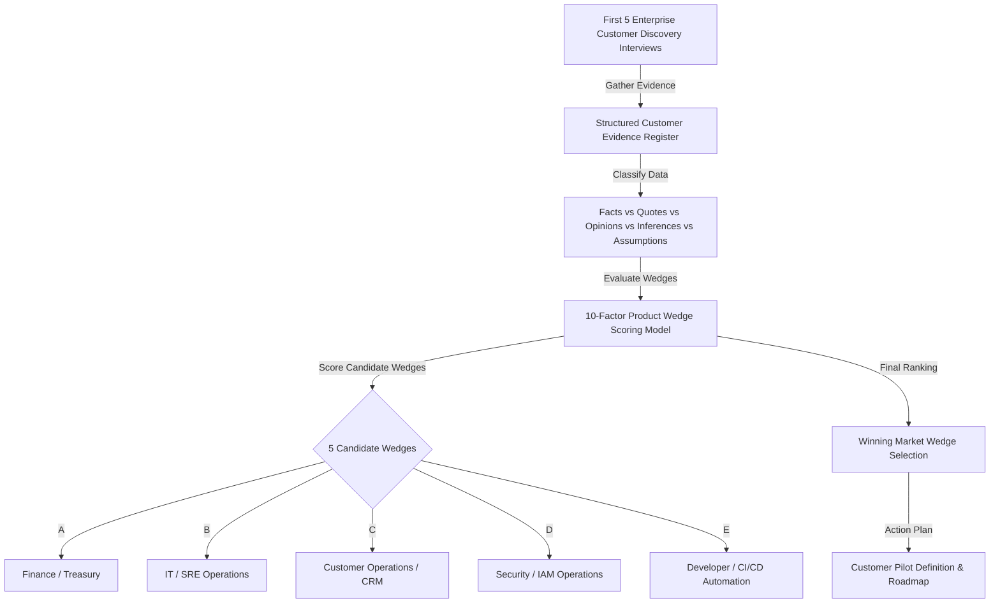

# AgentOS Phase 5 — Customer Discovery Execution & Product Wedge Validation Plan

**Version**: Phase 5 Discovery Framework v1.0  
**Baseline Implementation**: Phase 4B Streamable HTTP & Governance Sandbox  
**Core Thesis**: *"Your AI agents can act. AgentOS decides whether those actions are allowed."*  
**Primary Goal**: Execute unbiased customer discovery across 5 potential market wedges to identify the strongest initial commercial wedge before building new features.

---

## 1. Executive Strategy & Discovery Philosophy

In Phase 4A and Phase 4B, AgentOS proved that an enterprise control plane can govern high-risk actions over MCP Streamable HTTP using a synthetic financial wire-transfer baseline.

However, **we do not assume Finance/Treasury is the final or only market wedge**. Phase 5 establishes a disciplined, data-driven customer discovery methodology to discover where enterprise pain, urgency, and willingness to pay are highest.

---

## 2. Ideal Customer Profile (ICP) & Target Personas

### Ideal Customer Profile (ICP)
- **Organization Size**: Mid-Market (500–5,000 employees) or Enterprise (5,000+ employees).
- **AI Maturity**: Actively deploying or testing autonomous AI agents (Claude Desktop, Cursor, LangChain, AutoGen, CrewAI, custom LLM agents) in staging or production.
- **Action Capability**: AI agents possess tools capable of mutating state (e.g. database updates, API requests, financial transfers, IAM changes, deployment triggers).
- **Security / Compliance Environment**: Regulated or security-conscious industry (Fintech, SaaS, Healthcare, Banking, E-commerce, Enterprise IT).

### Target Personas
1. **CISO / VP Security**: Cares about data leakage, unauthorized write actions, prompt injection exploits, and audit compliance.
2. **CTO / VP Engineering**: Cares about developer velocity, agent reliability, infrastructure stability, and architectural complexity.
3. **Head of AI / Lead AI Engineer**: Cares about agent capabilities, MCP tool execution, model alignment, and operational friction.
4. **CFO / VP Treasury / VP Operations**: Cares about financial loss prevention, separation of duties, operational errors, and ROI.
5. **Security Architect / IAM Lead**: Cares about identity delegation, principal attribution, zero-trust enforcement, and API authorization.

---

## 3. 20 Potential Customer Profiles & Categories Across 5 Candidate Wedges

To ensure broad coverage without bias, discovery targets 4 profiles across 5 distinct candidate market wedges:

### Candidate Wedge A: Finance / Treasury
1. **Profile A1**: Mid-Market B2B Fintech — Financial automation agents managing vendor payments.
2. **Profile A2**: Enterprise E-Commerce Platform — AI refund and chargeback processing agents.
3. **Profile A3**: Corporate Treasury Department — Automated liquidity management and FX wire bots.
4. **Profile A4**: Accounts Payable SaaS — Invoice processing AI agents initiating payment approvals.

### Candidate Wedge B: IT / SRE Operations
5. **Profile B1**: Enterprise Cloud Managed Service Provider — SRE AI agents managing AWS/GCP infrastructure modifications.
6. **Profile B2**: High-Growth SaaS Vendor — DevOps AI agents executing automated production deployments.
7. **Profile B3**: Financial Services IT — Infrastructure remediation agents responding to P1 incident alerts.
8. **Profile B4**: Global Logistics Enterprise — Network and database migration automation agents.

### Candidate Wedge C: Customer Operations / CRM
9. **Profile C1**: Global Telecommunications Carrier — Customer support AI agents issuing billing credits & plan adjustments.
10. **Profile C2**: B2C E-Commerce Marketplace — AI agents modifying order status, shipping addresses, and returns.
11. **Profile C3**: Enterprise CRM Vendor — Sales AI agents modifying account ownership, quotas, and deal terms.
12. **Profile C4**: Insurtech Platform — Claims processing AI agents disbursing low-value claim payouts.

### Candidate Wedge D: Security / IAM Operations
13. **Profile D1**: Enterprise Security Operations Center (SOC) — Security AI agents orchestrating automated threat containment.
14. **Profile D2**: Cloud Identity SaaS Provider — Access management AI agents provisioning temporary IAM permissions.
15. **Profile D3**: Healthcare Healthtech Platform — Compliance AI agents granting emergency EHR access.
16. **Profile D4**: Multi-Cloud Enterprise — IAM remediation bots revoking overly permissive security group rules.

### Candidate Wedge E: Developer / Engineering Automation
17. **Profile E1**: Developer Tooling Enterprise — AI coding assistants (Cursor, Claude) with local file & terminal execution capabilities.
18. **Profile E2**: Internal Developer Platform (IDP) Team — Infrastructure-as-Code (Terraform) AI generation & apply bots.
19. **Profile E3**: Database Managed Service — AI DBA agents executing schema migrations and query optimizations.
20. **Profile E4**: CI/CD Platform Vendor — Pipeline automation agents modifying release targets and secret variables.

---

## 4. Pilot Qualification Criteria

To qualify a customer as a **Serious Pilot Candidate**, the organization must meet at least 6 of the following 9 criteria:

1. **Active AI Agents**: Possesses production or staging AI agents currently executing write/mutation actions.
2. **Identifiable High-Risk Action**: Can explicitly point to at least one action that causes high operational, financial, or security anxiety.
3. **Authorization Gap**: Acknowledges that prompt filtering or model system prompts are insufficient for security governance.
4. **Stakeholder Engagement**: Security/CISO or CTO owner is actively engaged in the evaluation.
5. **Technical Integration Ability**: Engineering team has the technical capability to integrate MCP Streamable HTTP or REST API gateways.
6. **Willingness to Pilot**: Expresses willingness to deploy AgentOS in a sandbox or staging environment within 30 days.
7. **Follow-Up Commitment**: Agrees to schedule a technical architecture review and pilot scope meeting.
8. **Budget Potential**: Has identified budget or discretionary innovation spend for AI governance/security tools.
9. **Feedback Partnership**: Agrees to provide bi-weekly product feedback during the 30-day pilot.

---

## 5. Final Decision Framework

At the conclusion of the first 5 customer interviews, AgentOS leadership will evaluate customer evidence against the following decision matrix:

| Customer Evidence Pattern | Strategic Decision | Next Action |
| :--- | :--- | :--- |
| **Pattern 1**: Customers report highest pain & willingness to pay in **Finance/Treasury** (wire transfers, payment initiation). | **Validate Financial Wedge** | Proceed to build production banking connectors (Stripe, Plaid) and Slack approvals. |
| **Pattern 2**: Customers report highest pain & urgency in **IT/SRE Operations** (IAM changes, Terraform apply, cloud mutations). | **Pivot to IT/SRE Wedge** | Refocus control plane branding, build AWS IAM / K8s action schemas, and target CISOs/DevOps leads. |
| **Pattern 3**: Customers report highest pain in **Customer Operations** (refunds, CRM state changes). | **Pivot to Support/CRM Wedge** | Build Salesforce/Zendesk action adapters and target VP Customer Experience. |
| **Pattern 4**: Customers experience the authorization problem but **refuse to pay for a SaaS control plane** (insisting on open source / local SDK). | **Reconsider Business Model** | Shift to an open-core local SDK model with enterprise control plane add-ons. |
| **Pattern 5**: Customers require **on-premise / VPC single-tenant isolation** before testing any sandbox. | **Prioritize Deployment Architecture** | Package AgentOS as a Helm chart / Docker Compose container for VPC deployment. |
